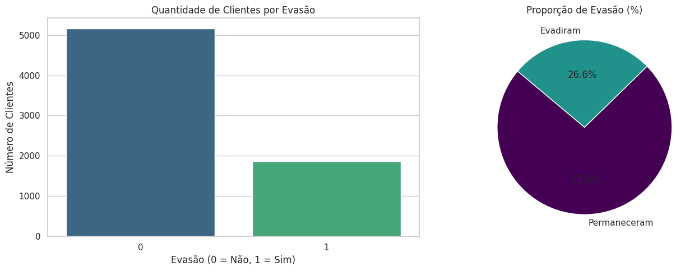
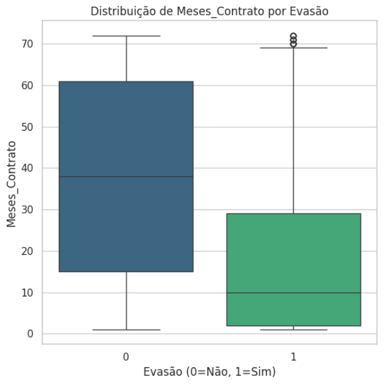
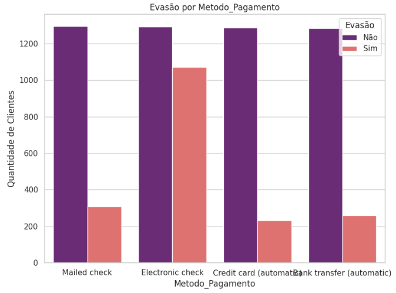
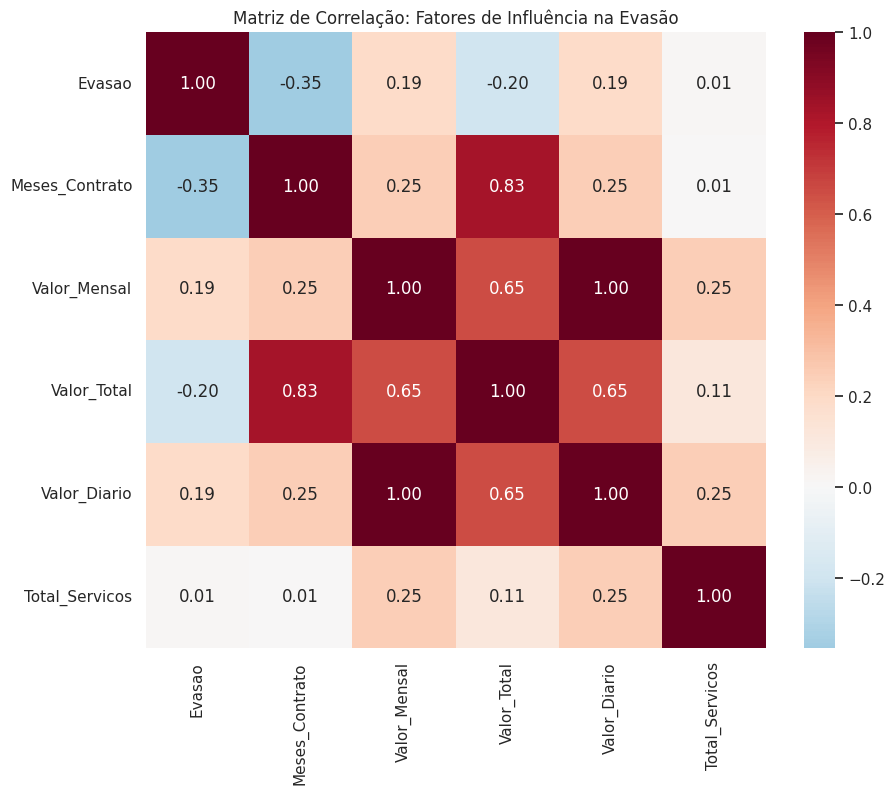

# Challenge Data Science: Análise de Churn da Telecom X 📡


---

# 📋 Sobre o Projeto

Este projeto foi desenvolvido como parte do **Challenge 2** do programa **Oracle Next Education (ONE)**.

O objetivo foi construir um pipeline completo de **ETL (Extract, Transform, Load)** e realizar uma **Análise Exploratória de Dados (EDA)** para identificar os principais fatores associados à **evasão de clientes (Churn)** em uma empresa de telecomunicações.

A partir de dados brutos extraídos de uma API, o projeto transforma as informações em dados estruturados que permitem identificar padrões **demográficos, financeiros e contratuais** relacionados à retenção de clientes.

---

# 🛠️ Tecnologias Utilizadas

- **Python 3.13**
- **Pandas**
- **Seaborn**
- **Matplotlib**
- **Requests (API)**
- **JSON**

---

# 📑 Etapas de Implementação

## 1️⃣ Extração e Tratamento (ETL)

**Extração**
- Coleta de dados via API
- Normalização (*flattening*) de objetos JSON aninhados

**Limpeza**
- Identificação de inconsistências em campos numéricos
- Tratamento de valores ausentes (`NaN`)

**Transformação**
- Tradução de variáveis para o português
- Binarização de colunas categóricas (`Sim/Não → 1/0`)
- Conversão de variáveis financeiras para `float64`

**Engenharia de Atributos**
- Criação das variáveis:
  - `Valor_Diario`
  - `Total_Servicos`

---

## 2️⃣ Análise Exploratória de Dados (EDA)

A análise foi conduzida em quatro etapas principais:

**Análise Descritiva**
- Métricas de tendência central:
  - Média
  - Mediana
  - Moda
- Métricas de dispersão:
  - Desvio padrão

**Distribuição da Evasão**
- Análise da frequência absoluta e percentual da variável **Churn**

**Cruzamento Categórico**
- Avaliação do impacto de:
  - tipo de contrato
  - método de pagamento

**Cruzamento Numérico**
- Boxplots
- Matriz de correlação entre variáveis numéricas

---

# 📊 Visualizações

A seguir estão algumas visualizações geradas durante a análise exploratória dos dados.

---

### Distribuição de Churn



Essa visualização mostra a proporção de clientes que permaneceram e os que cancelaram o serviço.

---

### Tempo de Permanência vs Evasão



O gráfico evidencia que clientes com menor tempo de contrato apresentam maior probabilidade de evasão.

---

### Método de Pagamento vs Churn



Clientes que utilizam **Electronic Check** apresentam maior taxa de cancelamento em comparação aos métodos automáticos.

---

### Matriz de Correlação



A matriz de correlação mostra o relacionamento entre as variáveis numéricas do dataset.

---

# 📈 Principais Insights

**Fator de Fidelidade**

Clientes com menos de **10 meses de contrato** apresentam maior probabilidade de evasão.

**Sensibilidade ao Preço**

Existe uma correlação positiva entre **valores mensais elevados (`Valor_Mensal`)** e cancelamento do serviço.

**Método de Pagamento**

Clientes que utilizam **Electronic Check** possuem uma taxa de evasão significativamente maior.

**Tempo de Permanência**

A variável **Meses_Contrato** aparece como o principal **preditor inverso de churn** (-0.35).

---

# 💡 Insight Estratégico

Os dados indicam que clientes com **contratos mensais e pagamento via Electronic Check** apresentam maior probabilidade de evasão.

Uma estratégia possível seria:

- incentivar a migração para **contratos anuais**
- oferecer **benefícios para métodos de pagamento automáticos**

Essas ações podem reduzir o churn ao aumentar o compromisso do cliente com o serviço.

---

## 📂 Estrutura do Repositório

```
.
├── challgene2_TelecomX_BR.ipynb
├── TelecomX_Dados_Processados.csv
├── images
│   ├── boxplot_evasao.png
│   ├── evasao_churn.png
│   ├── evasao_metodo_pagamento.png
│   └── matrix_correlacao.png
└── README.md
```

**challgene2_TelecomX_BR.ipynb**

Notebook contendo todo o pipeline do projeto:

- Extração de dados via API
- Limpeza e transformação dos dados
- Engenharia de atributos
- Análise exploratória
- Geração das visualizações utilizadas no estudo do churn

---

## 👨‍💻 Autor

**Artur Soares**  
Estudante de **Ciência da Computação — UFPB**

Programa **Oracle Next Education (ONE)**  
Trilha **Data Science**
